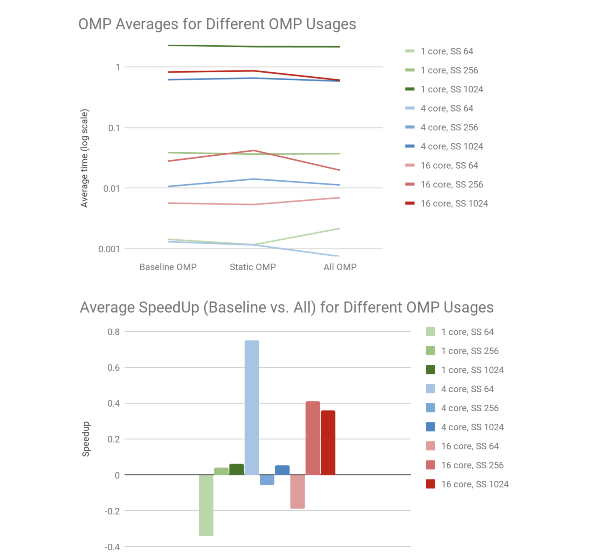

### Goal: Explore openmp multithreading and compare the speed of different pragma operations in order to do so, we solve a linear system of equations via Gauss-Jordan elimination

The original baseline implementation included just a single pragma directive that parallelized the main calculation during the gaussian elimination part of the algorithm. Although this was significantly faster than a serial solution, a lot of improvements can be made to the baseline solution to speed up the computation. 

The first change made was to declare the team of pragma threads on line 34, using pragma omp parallel , using this declaration, we are now able to use re use the same team of threads multiple times throughout the algorithm. The next objective was to determine where to use the threads and which parts of the algorithm can be parallelized. There are two additional portions of the algorithm that can be parallelized, one is the inner loop of the Jordan elimination and another is the determination of the main solution in the final for loop. Along with these two changes, we also changed the main pragma directive from the baseline solution to re use the team of threads that was declared.

Using the above changes, we expected to see an increase in speed from the baseline solutions. However, when testing, we noticed that the answer we were getting once the new directives were added were wrong and it was not passing the serial tester. Upon further investigation, we realized that there was a part of the algorithm that we are unable to parallelize and that should be executed using a single thread. Using pragma omp single, we are now able to ensure that the code of block is only run by one thread, after which the returned results were correct.

### Performance 
There were several different variations of directives that was implemented to observe if the change in times were any different, however, the drift in timing for a single solution in different trials was much greater than the change in time for different solutions such as using dynamic scheduling vs static scheduling. 

Using dynamic scheduling with the default number of chunks made the most drastic difference in terms of speedup. Using static scheduling with 10 chunks and with 64 chunks both resulted in almost no speedup when compared to the baseline, with 10 chunks being slower than the baseline. The dynamic scheduling however resulted in observable differences in the speedup of the algorithm. The table below shows the difference between static scheduling and dynamic scheduling.

### Try it out

There are three components to this project:
1) Datagen
    - Generates the input data for the program
2) Serialtester
    - Has the correct serial implementation of a gauss-jordan solver
    - Used to test the correctness of the multithreaded solution
3) LinearSystemSolver
    - Includes the multithreaded solution via openmp
    - The given baseline solution is also present

### Build instructions 

To make: 
 - `$ make all`
 - `$ make mac` for MacOS X ([ensure gcc-7 installed](http://www.mathcancer.org/blog/setting-up-gcc-openmp-on-osx-homebrew-edition/))

### Run instructions

A bash script is provided to quickly run and test the multithreaded solution with the following parameters:
 - Input size of the data: 64, 256, 1024
 - Number of threads: 1, 4, 16 
 - Duplicates (amount of times each trial is run): 4

To run the script:
 - `chmod +x check.sh`
 - `./check.sh`

